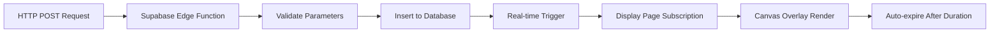

# Temporary Messages System - Complete Setup Guide

## Overview
This system allows you to send POST HTTP requests to display temporary messages on specific zones of your LED display. Messages can target multiple zones and use different animations.

## Features ✨
- ✅ **Multi-zone targeting**: `Zone=1,3,4` targets zones 1, 3, and 4 simultaneously
- ✅ **Multiple animations**: fade, slide, scroll, none
- ✅ **Priority system**: Latest message per zone takes precedence  
- ✅ **Real-time updates**: No page refresh needed
- ✅ **Auto-expiry**: Messages automatically disappear after duration
- ✅ **Non-disruptive**: Other zones continue normal display

## Setup Instructions

### 1. Database Setup
Execute the SQL schema in your Supabase Dashboard → SQL Editor:

```sql
-- Copy and paste the contents of temporary_messages_schema.sql
```

### 2. Enable Real-time
**CRITICAL**: Enable real-time for the table:

**Option A - via Dashboard:**
1. Go to **Database** → **Replication**
2. Find `temporary_messages` table
3. Toggle **ON** the switch

**Option B - via SQL:**
```sql
ALTER PUBLICATION supabase_realtime ADD TABLE temporary_messages;
```

### 3. Deploy Edge Function
```bash
# Install Supabase CLI
npm install -g supabase

# Login and link project
supabase login
supabase link --project-ref gpcfhhwasgnzvhnnaogq

# Deploy function
supabase functions deploy display
```

### 4. Configure Environment Variables
In Supabase Dashboard → Settings → Edge Functions:
- `SUPABASE_URL`: `https://gpcfhhwasgnzvhnnaogq.supabase.co`
- `SUPABASE_SERVICE_ROLE_KEY`: Get from Settings → API (service_role key)

### 5. Deploy to Vercel
```bash
npm run build
vercel --prod
```

## Usage

### Your Edge Function URL:
```
https://gpcfhhwasgnzvhnnaogq.supabase.co/functions/v1/display
```

### POST Request Format:
```
POST https://gpcfhhwasgnzvhnnaogq.supabase.co/functions/v1/display?Zone=1,3,4&Msg=Emergency%20Exit&Duration=15&Anim=scroll
```

### Parameters:

| Parameter | Required | Type | Description | Example |
|-----------|----------|------|-------------|---------|
| `Zone` | ✅ | string | Zone IDs separated by commas | `1,3,4` or `2` |
| `Msg` | ✅ | string | Message text (URL encoded) | `Emergency%20Exit` |
| `Duration` | ✅ | number | Duration in seconds (1-300) | `15` |
| `Anim` | ❌ | string | Animation type | `fade` (default), `slide`, `scroll`, `none` |

### Animation Types:
- **`fade`**: Smooth fade in/out effect
- **`slide`**: Slides in from right, slides out to left  
- **`scroll`**: Scrolls text across the zone
- **`none`**: Static display, no animation

## Example Requests

### Basic Examples:
```bash
# Single zone with fade
curl -X POST 'https://gpcfhhwasgnzvhnnaogq.supabase.co/functions/v1/display?Zone=2&Msg=Hello%20World&Duration=10&Anim=fade'

# Multiple zones with scroll
curl -X POST 'https://gpcfhhwasgnzvhnnaogq.supabase.co/functions/v1/display?Zone=1,3,4&Msg=Emergency%20Exit&Duration=15&Anim=scroll'

# All zones with slide
curl -X POST 'https://gpcfhhwasgnzvhnnaogq.supabase.co/functions/v1/display?Zone=1,2,3,4&Msg=SYSTEM%20ALERT&Duration=20&Anim=slide'
```

### Real-world Use Cases:
```bash
# Donation alert (5 seconds, fade)
curl -X POST 'https://gpcfhhwasgnzvhnnaogq.supabase.co/functions/v1/display?Zone=1&Msg=Thanks%20for%20the%20donation!&Duration=5&Anim=fade'

# Game achievement (3 seconds, slide)  
curl -X POST 'https://gpcfhhwasgnzvhnnaogq.supabase.co/functions/v1/display?Zone=2&Msg=HEADSHOT!&Duration=3&Anim=slide'

# Breaking news (30 seconds, scroll on multiple zones)
curl -X POST 'https://gpcfhhwasgnzvhnnaogq.supabase.co/functions/v1/display?Zone=1,2,3&Msg=BREAKING%20NEWS%20UPDATE&Duration=30&Anim=scroll'

# Social media reminder (12 seconds, no animation)
curl -X POST 'https://gpcfhhwasgnzvhnnaogq.supabase.co/functions/v1/display?Zone=4&Msg=Follow%20@YourHandle&Duration=12&Anim=none'
```

## Testing

Run the test script to verify everything works:
```bash
./test-temporary-messages.sh
```

## Integration Examples

### JavaScript/TypeScript:
```typescript
const sendMessage = async (zones: number[], message: string, duration: number, animation: string = 'fade') => {
  const response = await fetch(`https://gpcfhhwasgnzvhnnaogq.supabase.co/functions/v1/display?Zone=${zones.join(',')}&Msg=${encodeURIComponent(message)}&Duration=${duration}&Anim=${animation}`, {
    method: 'POST'
  })
  return response.json()
}

// Usage
sendMessage([1, 3], 'Hello World!', 10, 'fade')
```

### Python:
```python
import requests
from urllib.parse import quote

def send_message(zones, message, duration, animation='fade'):
    url = f"https://gpcfhhwasgnzvhnnaogq.supabase.co/functions/v1/display"
    params = {
        'Zone': ','.join(map(str, zones)),
        'Msg': quote(message),
        'Duration': duration,
        'Anim': animation
    }
    return requests.post(url, params=params).json()

# Usage
send_message([2, 4], 'Python says hello!', 8, 'scroll')
```

### Node.js:
```javascript
const axios = require('axios')

const sendMessage = async (zones, message, duration, animation = 'fade') => {
  const response = await axios.post(`https://gpcfhhwasgnzvhnnaogq.supabase.co/functions/v1/display?Zone=${zones.join(',')}&Msg=${encodeURIComponent(message)}&Duration=${duration}&Anim=${animation}`)
  return response.data
}

// Usage
sendMessage([1, 2, 3, 4], 'Node.js Alert!', 15, 'slide')
```

## How It Works



## Troubleshooting

### Common Issues:

1. **Messages not appearing:**
   - Check if you're on the `/display` page
   - Verify real-time is enabled for `temporary_messages` table
   - Check browser console for errors

2. **Edge Function errors:**
   - Verify environment variables are set in Supabase
   - Check function deployment was successful
   - Ensure service role key has correct permissions

3. **Database errors:**
   - Confirm SQL schema was executed successfully
   - Check zone IDs are between 1-4
   - Verify duration is between 1-300 seconds

### Debug Commands:
```bash
# Test Edge Function health
curl -X OPTIONS 'https://gpcfhhwasgnzvhnnaogq.supabase.co/functions/v1/display'

# Check current messages in database
# (Use Supabase SQL Editor)
SELECT * FROM temporary_messages WHERE is_active = true ORDER BY created_at DESC;

# Manually clean up expired messages  
UPDATE temporary_messages SET is_active = false WHERE expires_at <= NOW();
```

## Production Considerations

1. **Rate Limiting**: Consider implementing rate limiting for public endpoints
2. **Authentication**: Add API key authentication if needed
3. **Monitoring**: Set up logging and monitoring for the Edge Function
4. **Caching**: Messages are automatically cached in the frontend state
5. **Backup**: Regular database backups include message history

## Success Response:
```json
{
  "success": true,
  "message": "Temporary message created successfully",
  "data": {
    "id": "550e8400-e29b-41d4-a716-446655440000",
    "zones": [1, 3, 4],
    "message": "Emergency Exit",
    "duration": 15,
    "animation": "scroll",
    "expires_at": "2024-01-01T12:00:15.000Z",
    "created_at": "2024-01-01T12:00:00.000Z"
  }
}
```

## Error Response:
```json
{
  "error": "Invalid zone IDs",
  "message": "Zone IDs must be between 1 and 4",
  "invalidZones": [5],
  "received": [1, 3, 5]
}
```

---

🎉 **Your temporary messages system is now ready!** 

Send POST requests to your Edge Function URL and watch messages appear instantly on your display without any page refresh!